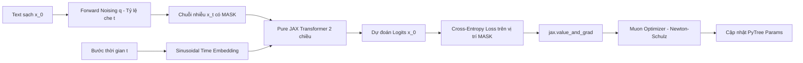
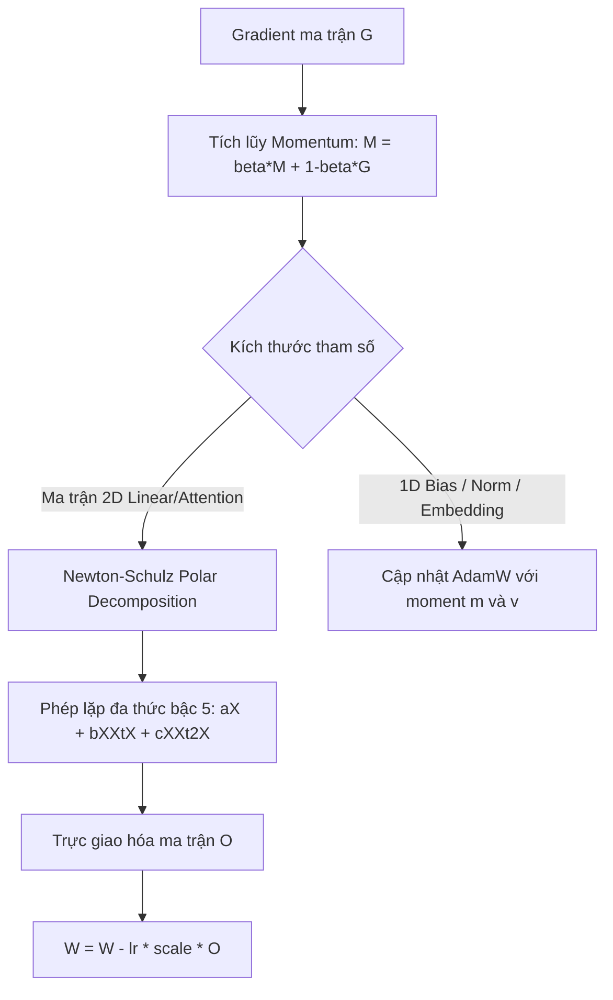

# 🧠 Pure JAX Diffusion Language Model (DLM) from Scratch

Một dự án mã nguồn mở mini được xây dựng hoàn toàn từ số không (**from scratch**) bằng **Pure JAX 100%** phục vụ mục đích học tập và nghiên cứu chuyên sâu. 

Toàn bộ các thành phần:
- 🏗️ **Kiến trúc mô hình**: Bidirectional Transformer với cơ chế điều kiện hóa thời gian khuếch tán (**Timestep Conditioning**).
- ⚡ **Thuật toán tối ưu hóa**: **Muon Optimizer** (Momentum Orthogonalized by Newton-Schulz) kết hợp phân vùng lai **AdamW** thuần JAX.
- 📉 **Lập lịch tốc độ học**: **Cosine Warmup Learning Rate Scheduler** thuần JAX (không dùng Optax).
- 🌪️ **Quy trình khuếch tán**: **Discrete Masked Diffusion (MDLM / Absorbing State)** với quá trình thêm nhiễu và khử nhiễu ngược (**Ancestral Reverse Sampling**).

> **Tuyệt đối không dùng framework cấp cao**: Không dùng Flax, Haiku, Trax, PyTorch, Optax, hay HuggingFace. Toàn bộ tham số và trạng thái được quản lý dạng **PyTree thuần khiết**, lan truyền vi phân bằng `jax.value_and_grad` và biên dịch tăng tốc phần cứng qua `jax.jit`.

---

## 📐 1. Tổng Quan Kiến Trúc & Luồng Xử Lý



---

## 🔬 2. Lý Thuyết & Toán Học Cốt Lõi

### 2.1. Tại sao dùng Discrete Masked Diffusion thay vì Continuous Diffusion?
Trong xử lý ảnh (DDPM/Stable Diffusion), dữ liệu là các giá trị thực liên tục $\mathbf{x} \in \mathbb{R}^D$, ta có thể cộng nhiễu Gauss $\mathcal{N}(0, \sigma^2 I)$ mượt mà. 

Trong xử lý ngôn ngữ tự nhiên:
- Từ ngữ là các phần tử **rời rạc** trong không gian từ vựng hữu hạn $\mathcal{V}$.
- Nếu nhúng từ thành vector rồi cộng nhiễu Gauss, việc chiếu ngược về từ vựng (rounding) tạo ra sai số rất lớn và làm sập không gian biểu diễn (manifold collapse).
- **Masked Diffusion (MDLM)** định nghĩa chuỗi Markov trực tiếp trên không gian rời rạc với **trạng thái hấp thụ** (Absorbing State) là token đặc biệt `[MASK]`:
  
$$\mathbf{q}(x_t \mid x_0) = \prod_{i=1}^L \left( (1 - t)\delta(x_t^i, x_0^i) + t \delta(x_t^i, [\text{MASK}]) \right)$$

Tại $t = 0$: Chuỗi nguyên bản sạch 100%.  
Tại $t = 1$: Toàn bộ câu là token `[MASK]` (nhiễu 100%).

### 2.2. Hàm mất mát (Loss Function)
Cận dưới biến phân (ELBO) của Discrete Diffusion được rút gọn thành hàm mất mát Cross-Entropy tính **chỉ trên các vị trí bị che mặt nạ**:

$$\mathcal{L}(\theta) = \mathbb{E}_{t \sim \mathcal{U}(0, 1), \, x_t \sim q(x_t \mid x_0)} \left[ \frac{1}{\sum_{i} \mathbb{I}(x_t^i = [\text{MASK}])} \sum_{i: x_t^i = [\text{MASK}]} -\log p_\theta(x_0^i \mid x_t, t) \right]$$

### 2.3. Quy trình sinh ngược (Reverse Sampling Trajectory)
Bắt đầu từ một chuỗi toàn bộ là `[MASK]` tại $t = 1.0$, tại mỗi bước $s$ đi lùi từ $t$ về $t_{\text{next}} = t - \Delta t$:
1. Mô hình nhìn toàn bộ ngữ cảnh hai chiều để dự đoán phân phối xác suất các từ gốc: $\hat{x}_0 \sim \text{Categorical}(\text{logits} / \tau)$.
2. Xác suất gỡ bỏ mặt nạ tại bước này cho mỗi vị trí đang bị che là:
   
$$P(\text{unmask}) = \frac{t - t_{\text{next}}}{t}$$

3. Nếu unmask, vị trí đó được điền giá trị $\hat{x}_0$ vừa dự đoán. Nếu chưa, token tiếp tục ở trạng thái `[MASK]` để các bước tiếp theo hoàn thiện dần.

---

## ⚡ 3. Thuật Toán Tối Ưu Hóa Muon (Pure JAX)

**Muon** (*Momentum Orthogonalized by Newton-Schulz*) là thuật toán tối ưu hóa hiện đại được đề xuất bởi Keller Jordan:



### Chi tiết phép lặp Newton-Schulz bậc 5:
Để trực giao hóa ma trận động lượng $M \in \mathbb{R}^{m \times n}$ mà không cần phân rã SVD tốn kém $\mathcal{O}(mn^2)$, Muon chuẩn hóa ma trận $X_0 = M / (\|M\|_F + \epsilon)$ và lặp 5 lần với đa thức quintic:

$$X_{k+1} = a X_k + b (X_k X_k^T) X_k + c (X_k X_k^T)^2 X_k$$

Hệ số tối ưu: $a = 3.4445$, $b = -4.7750$, $c = 2.0315$.  
Hàm đa thức này kéo mọi giá trị suy biến (singular values) của ma trận cập nhật tiệm cận về $1.0$, giữ năng lượng phổ cân bằng tuyệt đối trên mọi hướng không gian con.

---

## 📁 4. Cấu Trúc Thư Mục

```text
jax-diffusion-lm/
├── README.md                 # Tài liệu lý thuyết, công thức toán và hướng dẫn
├── requirements.txt          # Thư viện phụ thuộc tối thiểu (chỉ JAX và numpy)
├── train.py                  # Script huấn luyện end-to-end với JIT và Muon
├── sample.py                 # Script trình diễn trực quan hóa quá trình khử nhiễu
└── src/
    ├── __init__.py           # Giao diện đóng gói các module cốt lõi
    ├── model.py              # Pure JAX Bidirectional Transformer + Timestep MLP
    ├── diffusion.py          # Quy trình Discrete Masked Diffusion (q_sample, loss, sample)
    ├── tokenizer.py          # Character-level Tokenizer tự viết (zero dependencies)
    ├── utils.py              # Tiện ích PyTree, đếm tham số, chuẩn bị batch
    └── optimizers/
        ├── __init__.py       # Expose optimizer & scheduler
        ├── muon.py           # Thuật toán Muon thuần JAX (Newton-Schulz + AdamW hybrid)
        └── schedulers.py     # Cosine decay với linear warmup thuần JAX
```

---

## 🚀 5. Hướng Dẫn Cài Đặt & Chạy Thử

### 5.1. Kích hoạt môi trường JAX
Nếu bạn đã có môi trường Conda hỗ trợ JAX (như môi trường `jax` có sẵn):
```bash
conda activate jax
```
Hoặc cài đặt vào môi trường Python bất kỳ:
```bash
pip install -r requirements.txt
```

### 5.2. Chạy kịch bản trực quan hóa quá trình sinh văn bản (Sampling)
Quan sát mô hình đi từ chuỗi đen đặc `████████` đến chuỗi ký tự hoàn chỉnh:
```bash
python sample.py
```
**Kết quả hiển thị trên terminal:**
```text
===========================================================================
 QUAN SÁT TIẾN TRÌNH KHỬ NHIỄU KHUẾCH TÁN (STEP-BY-STEP DENOISING)
 Số bước khuếch tán ngược: 10 | Độ dài: 64 ký tự | Nhiệt độ: 0.8
===========================================================================
Bước [00/10] (t=1.00 - Nhiễu 100%):
  ████████████████████████████████████████████████████████████████

Bước [01/10] (t=0.90 | Còn 56 masks - 87.5%):
  ████████████BV███████████F█████████C███████A████████(█o█r███████
Bước [05/10] (t=0.50 | Còn 31 masks - 48.4%):
  █ny█U██)█]<█BV3██t]█a███FI██r^██sC█\█&	o█A(B█O██g>(█o█r███████
Bước [10/10] (t=0.00 | Còn 00 masks -  0.0%):
  %ny\U6()[]<RBV3"<t]*ag_)FIUKr^}OsCL\e&	oGA(BRO@\g>(aofr+c~1ki
```

### 5.3. Huấn luyện mô hình với Muon Optimizer
Chạy quá trình huấn luyện trên mini-corpus và quan sát loss giảm liên tục:
```bash
python train.py
```
Trình biên dịch XLA (`jax.jit`) sẽ tự động nung toàn bộ forward pass, backward pass (`value_and_grad`) và thuật toán Newton-Schulz thành một kernel tăng tốc duy nhất chạy mượt mà trên Apple Silicon M4.
