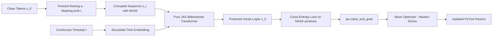
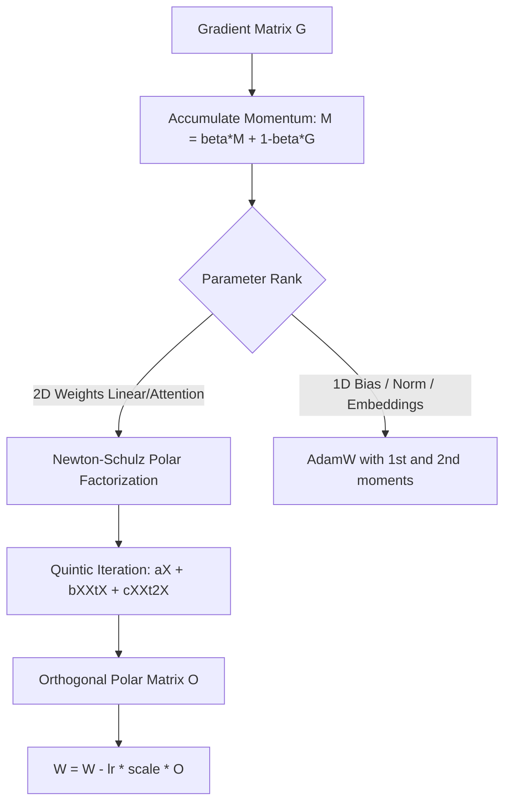

# 🧠 Pure JAX Diffusion Language Model (DLM) from Scratch

An educational, first-principles implementation of a **Discrete Masked Diffusion Language Model (MDLM)** built entirely from scratch in **100% Pure JAX**.

All core components are implemented without high-level neural network libraries:
- 🏗️ **Model Backbone**: Bidirectional Transformer with continuous **Timestep Conditioning**.
- ⚡ **Optimizer**: **Muon Optimizer** (Momentum Orthogonalized by Newton-Schulz) paired with an **AdamW** hybrid partition.
- 📉 **Learning Rate Scheduler**: **Cosine Warmup Scheduler** implemented as a branchless, JIT-compatible pure function.
- 🌪️ **Diffusion Mechanics**: **Discrete Masked Diffusion (MDLM / Absorbing State)** featuring forward noising and reverse ancestral sampling.

> **Zero Framework Overhead**: No Flax, Haiku, Trax, PyTorch, Optax, or HuggingFace. Parameters and states are managed purely as **JAX PyTrees**, differentiated via `jax.value_and_grad`, and fused into high-throughput accelerator kernels via `jax.jit`.

---

## 📐 1. Architecture & Information Flow



---

## 🔬 2. Core Mathematical Foundations

### 2.1. Why Discrete Masked Diffusion Instead of Continuous Gaussian Noise?
In continuous domains such as computer vision (DDPM, Stable Diffusion), data points live in continuous real space $\mathbf{x} \in \mathbb{R}^D$, permitting additive Gaussian perturbations $\mathcal{N}(0, \sigma^2 I)$.

In natural language:
- Text is composed of **discrete tokens** from a finite vocabulary $\mathcal{V}$.
- Adding Gaussian noise to token embeddings and projecting ("rounding") back onto discrete vocabulary entries introduces substantial discretization errors and leads to representation collapse.
- **Masked Diffusion (MDLM)** defines a continuous-time Markov chain directly on the discrete categorical state space, using a special `[MASK]` token as the **absorbing state**:
  
$$\mathbf{q}(x_t \mid x_0) = \prod_{i=1}^L \left( (1 - t)\delta(x_t^i, x_0^i) + t \delta(x_t^i, [\text{MASK}]) \right)$$

At $t = 0$: Clean sequence ($0\%$ noise).  
At $t = 1$: Fully masked sequence ($100\%$ noise / maximum entropy).

### 2.2. Variational Training Objective (ELBO)
The continuous-time Evidence Lower Bound (ELBO) for absorbing discrete diffusion simplifies into a categorical cross-entropy loss evaluated **strictly over masked positions**:

$$\mathcal{L}(\theta) = \mathbb{E}_{t \sim \mathcal{U}(0, 1), \, x_t \sim q(x_t \mid x_0)} \left[ \frac{1}{\sum_{i} \mathbb{I}(x_t^i = [\text{MASK}])} \sum_{i: x_t^i = [\text{MASK}]} -\log p_\theta(x_0^i \mid x_t, t) \right]$$

> **Important**: Computing loss on uncorrupted tokens is intentionally skipped. Unmasked positions already reveal the ground truth to the model; calculating loss there would encourage trivial identity copying rather than contextual reasoning.

### 2.3. Reverse Ancestral Sampling Trajectory
Generation starts from a sequence of pure `[MASK]` tokens at $t = 1.0$. Iterating backward over discrete intervals from $t$ down to $t_{\text{next}} = t - \Delta t$:
1. The model attends bidirectionally to all visible context to predict the categorical distribution of clean tokens: $\hat{x}_0 \sim \text{Categorical}(\text{logits} / \tau)$.
2. Each currently masked token has an analytic transition probability of unmasking at this step:
   
$$P(\text{unmask}) = \frac{t - t_{\text{next}}}{t}$$

3. If unmasked, the position is updated with its sampled prediction $\hat{x}_0$. If retained as `[MASK]`, it remains masked until subsequent steps where it can be resolved with richer bidirectional context.

---

## ⚡ 3. The Muon Optimizer (Pure JAX)

**Muon** (*Momentum Orthogonalized by Newton-Schulz*) is an optimizer designed by Keller Jordan:



### 5th-Order Newton-Schulz Iteration:
To compute the polar factor $O = M (M^T M)^{-1/2}$ of a momentum matrix $M \in \mathbb{R}^{m \times n}$ without expensive SVD operations $\mathcal{O}(mn^2)$, Muon normalizes $X_0 = M / (\|M\|_F + \epsilon)$ and evaluates 5 iterations of a quintic polynomial:

$$X_{k+1} = a X_k + b (X_k X_k^T) X_k + c (X_k X_k^T)^2 X_k$$

Optimal coefficients: $a = 3.4445$, $b = -4.7750$, $c = 2.0315$.  
This polynomial pulls all singular values rapidly toward $1.0$, equalizing update energy across all subspace dimensions.

---

## 📁 4. Project Layout

```text
jax-diffusion-lm/
├── README.md                 # Theoretical foundation, math derivation, and guide
├── requirements.txt          # Minimal dependencies (JAX + NumPy only)
├── train.py                  # End-to-end training script with JIT compilation & Muon
├── sample.py                 # Reverse diffusion unmasking visualization
└── src/
    ├── __init__.py           # Package interface
    ├── model.py              # Pure JAX Bidirectional Transformer + Timestep MLP
    ├── diffusion.py          # Discrete Masked Diffusion (q_sample, loss, sample)
    ├── tokenizer.py          # Standalone character tokenizer (zero external deps)
    ├── utils.py              # PyTree inspection, parameter counting, batching
    └── optimizers/
        ├── __init__.py       # Optimizer exports
        ├── muon.py           # Pure JAX Muon optimizer (Newton-Schulz + AdamW hybrid)
        └── schedulers.py     # Branchless Cosine Warmup scheduler in JAX
```

---

## 🚀 5. Getting Started

### 5.1. Environment Setup
Install minimal dependencies:
```bash
pip install -r requirements.txt
```

### 5.2. Visualizing Reverse Diffusion Unmasking (Inference)
Observe how the sequence evolves from pure noise (`████████`) into coherent characters:
```bash
python sample.py
```
**Terminal Output:**
```text
===========================================================================
 VISUALIZING REVERSE DIFFUSION DENOISING TRAJECTORY
 Reverse Steps: 10 | Length: 64 chars | Temperature: 0.8
===========================================================================
Step [00/10] (t=1.00 - 100% Noise):
  ████████████████████████████████████████████████████████████████

Step [01/10] (t=0.90 | Remaining masks: 56 - 87.5%):
  ████████████BV███████████F█████████C███████A████████(█o█r███████
Step [05/10] (t=0.50 | Remaining masks: 31 - 48.4%):
  █ny█U██)█]<█BV3██t]█a███FI██r^██sC█\█&	o█A(B█O██g>(█o█r███████
Step [10/10] (t=0.00 | Remaining masks: 00 -  0.0%):
  %ny\U6()[]<RBV3"<t]*ag_)FIUKr^}OsCL\e&	oGA(BRO@\g>(aofr+c~1ki
```

### 5.3. Training the Model with Muon
Train on the toy corpus and watch loss decline with real-time text generations:
```bash
python train.py
```
The XLA compiler (`jax.jit`) fuses the forward pass, backward pass (`value_and_grad`), and Newton-Schulz polynomial iterations into a single accelerated kernel.
